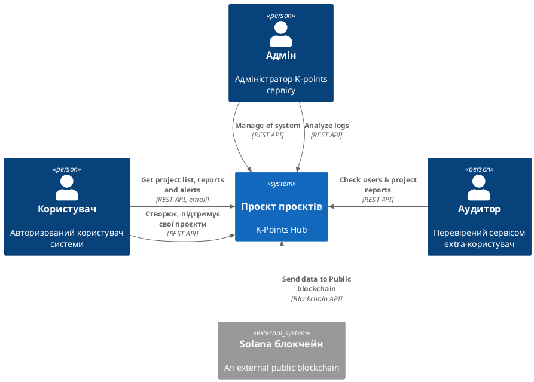
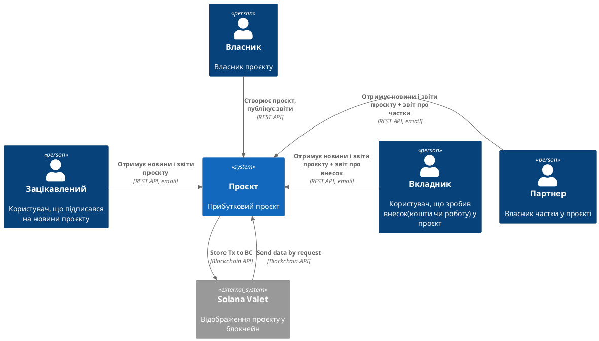

# Проєкт *"проєктів"*
Система для відстеження стартапів до їх створення.

# C1: Context 
## Ролі користувачів на сервісі:
* Адмін сервісу (admin)
* Користувач (user)
* Аудитор (auditor)

## Ролі користувачів на проєкті:
* Власник проєкту (owner)
* Зацікавлений (follower)
* Вкладник (contributor)
* Партнер (partner)

# C2: Containers
* Backend: REST API  
* Frontend: SPA (projects + project pages) 
* База даних проєктів (+ Flyway)
* Адмінка
* Пошуковий (і рекомендаційний) сервіс
* Feature request's сервіс
* Поштовий сервіс: Amazon SES
* SMM: Sitemap для кожного проєкту
* CI/CD: Build & deploy to test/prod environments 
* Моніторинг: Grafana with alerts to TG 

# C3: Components
## Backend: REST API 
* Spring Boot 3.2 + Spring MVC (JDK17, maven)
* Project Controller: CRUD with Swagger
* Auth: Spring Security by email or OAuth2 using Google 
* Models: User, Project 
## Frontend: SPA (projects + project pages)
* SPA using React 
* Auth: JWT token
## База даних проєктів (+ Flyway)
* RDS PostgreSQL
* Flyway
## Адмінка
* Список юзерів з можливістю бану (заборони авторизації)
* Список проєктів з можливістю зробити їх read-only та або прихованими
## Пошуковий (і рекомендаційний) сервіс
* Search by user requests and user attributes
* Search endpoint
* Prioritized list endpoint
## Feature request's сервіс
* RDS PostgreSQL?, search by user requests & attributes
* Search endpoint
## Поштовий сервіс: Amazon SES
* Amazon SES
* Approve user's emails
* Spring Schedule service for sending emails
## SMM: Sitemap для кожного проєкту
* Reglament to create Sitemap periodically
## CI/CD: Build & deploy to test/prod environments
* Setup CI/CD and describe review/merge rules
## Моніторинг: Grafana with alerts to TG
* Add request count metrics to all controllers
* Alert setup to the new telegram group 